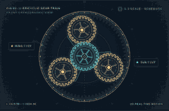

<div align="center">

# ⚙️ TORQUELAB
### Planetary Gear Studio

**Motion, made visible.** A responsive interactive engineering sandbox that makes planetary transmission kinematics tangible.


[Features](#features) · [Physics](#physics) · [Run locally](#run-locally) · [Tests](#tests) · [Deploy](#deploy)

</div>

## Preview

| Desktop studio | Mobile laboratory |
|:---:|:---:|
|  |  |



## Features

- **Animated planetary gear train** — schematic sun, ring, and three planets with geometrically scaled pitch radii and mechanically linked angular velocities.
- **Three power-flow modes** — sun-driven with ring fixed, ring-driven with sun fixed, and reversing transmission with carrier fixed.
- **Editable tooth counts** — sun and planet gears update the derived ring count instantly; step increments preserve 3-planet assembly geometry.
- **Engineering presets** — Balanced, High Torque and Compact.
- **Calculated telemetry** — reduction ratio, output shaft speed and direction, and absolute planet spin, updating as controls change.
- **Data export** — download configuration and results as JSON, render the mechanical diagram as PNG, or print a report.
- **Comparison chart** — inspect output speed across presets at the chosen input speed and fixed member.
- **Responsive, accessible interface** — mobile touch controls, focus states, and reduced-motion support.
- **No API keys or user accounts** — everything runs locally in the browser.

## Physics

Planetary kinematics uses the **Willis equation** for a simple sun–planet–ring gearset:

\[
N_s(\omega_s - \omega_c) + N_r(\omega_r - \omega_c) = 0
\]

For equal-module meshing, ring tooth count and three-planet angular spacing are constrained by:

\[
N_r = N_s + 2N_p, \qquad (N_s+N_r)\bmod 3 = 0
\]

The planet spin about its own axis (absolute angular velocity) is:

\[
\omega_p = \omega_c - \frac{N_s}{N_p}(\omega_s-\omega_c)
\]

| Drive mode | Held member | Driven member | Output | Nominal relationship |
|---|---|---|---|---|
| Ring fixed | Ring | Sun | Carrier | \(\omega_c = N_s/(N_s+N_r)\,\omega_s\) |
| Sun fixed | Sun | Ring | Carrier | \(\omega_c = N_r/(N_s+N_r)\,\omega_r\) |
| Carrier fixed | Carrier | Sun | Ring | \(\omega_r = -(N_s/N_r)\,\omega_s\) |

**Important:** This is an educational kinematic schematic. Drawn teeth are illustrative rather than production-quality involute tooth profiles. The simulator does not model gear losses, tooth bending, backlash, wear or torque limits. Gear geometry should be verified for manufacturing applications.

## Run locally

No package installation is necessary to run the page. It uses native JavaScript modules, so serve the folder using any static HTTP server rather than opening `index.html` directly from `file://`:

```bash
# Python 3
python -m http.server 8080
# Open http://localhost:8080
```

Alternatively, with Node.js 18+:

```bash
npm run dev
```

## Tests

Uses the built-in Node.js test runner, with **no test dependencies**:

```bash
npm test
```

The suite checks ratio identities, assembly geometry, all three drive modes, and invalid parameter handling. `.github/workflows/tests.yml` runs the tests on pushes, pull requests, manually, and every day at **04:15 UTC**.

## Deploy

This is a static website. You can host it for free on **GitHub Pages**, or import the repository into **Vercel** using static deployment settings. No database or environment variables required.

**GitHub Pages:** Repository → Settings → Pages → choose **GitHub Actions**. The included `.github/workflows/pages.yml` publishes on pushes to `main`. The project uses relative asset paths so it works under a project subpath.

## Architecture

```text
torquelab/
├── index.html                 # Semantic dashboard and controls
├── src/
│   ├── app.mjs                # Canvas rendering, UI interactions and exports
│   ├── physics.mjs            # Pure, testable planetary equations
│   └── styles.css             # Responsive instrument UI
├── tests/physics.test.mjs     # Numerical and geometry tests
├── assets/favicon.svg        # Brand icon
├── docs/
│   ├── demo.gif
│   ├── gear-render.png
│   ├── configuration-example.json
│   └── screenshots/
│       ├── desktop.png
│       └── mobile.png
└── .github/workflows/tests.yml
```

## Contributing

Found a problem or have an idea for a new drivetrain mode? Contributions are welcome. Please open an issue with reproducible inputs, or propose an isolated pull request with accompanying tests. See [CONTRIBUTING.md](CONTRIBUTING.md).

## License

MIT — see [LICENSE](LICENSE).